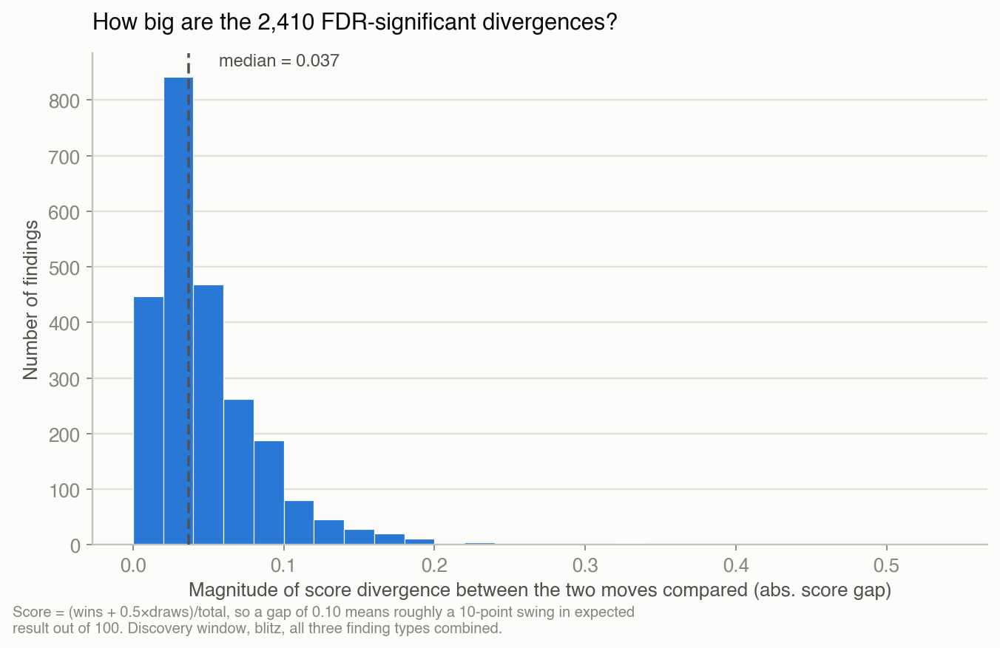
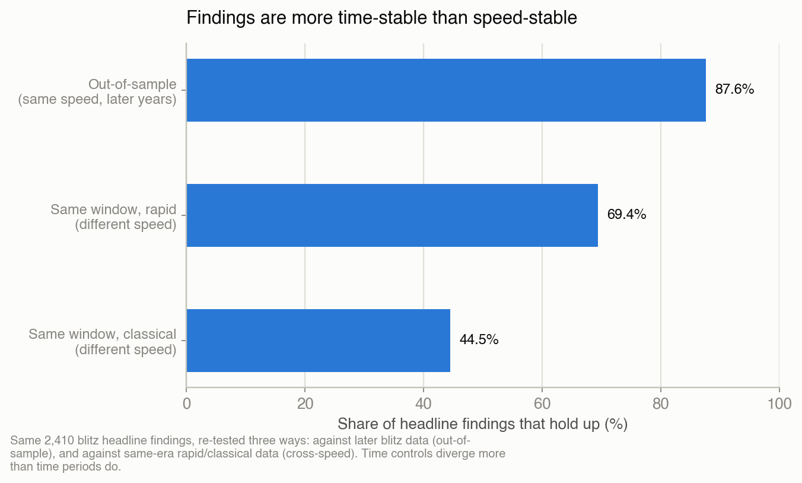
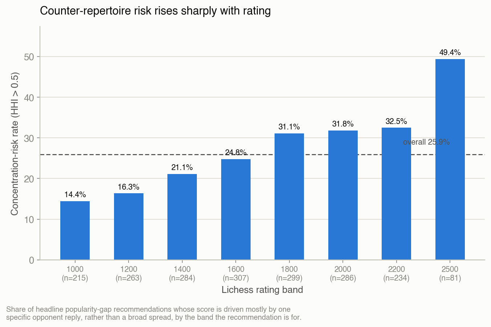

# Your Opening Theory Is Rated 2500. You Are Not.

> **In short:** I queried the Lichess Opening Explorer API roughly 14,000
> times to test whether a chess opening's textbook reputation actually
> matches how it scores at different skill levels. Across 408 opening
> positions and 2,837 statistical comparisons, 2,410 divergences survived
> multiple-comparisons correction, and 87.6% of those replicated against a
> held-out validation window I never looked at while building the model.
> The pipeline also passed its own null-hypothesis calibration check, and
> one real bug — a missing sample-size guard that let a single-game sample
> masquerade as a significant finding — got caught and fixed along the
> way. Code, raw JSON, and the full technical writeup are public; this is
> the plain-language version.

## The hook

Opening theory is written by strong players, for strong players. The move
that's "best" in a Ruy Lopez or a Sicilian is usually whatever grandmasters
and engines agree holds the most objective value — a claim about chess as
a perfect-information game, not about chess as it's actually played by two
humans who are tired, low on time, and rated 1200.

That gap is measurable. Lichess's Opening Explorer publishes aggregate
win/draw/loss counts for every position that's ever been reached in a rated
game, broken out by rating band. If "best" theory and "best" in practice
diverge, it shows up directly in those numbers: two moves out of the same
position, same rating band, with different empirical scores.

Here's a concrete one. In the Traxler Counterattack (1. e4 e5 2. Nf3 Nc6 3.
Bc4 Nf6 4. Ng5 Bc5 5. Nxf7, White grabs the f7 pawn with check), Black has
two natural-looking replies: recapture the initiative with **Bxf2+**, or
just castle with **O-O** and leave the knight on f7 alone. Bxf2+ is played
72,457 times in games at the 1000 rating band on Lichess — it's the
popular move, the one that "feels" right, forcing and disruptive. O-O is
played only 3,934 times. But O-O scores **0.923** (expected score, where 1.0
is a guaranteed win) against Bxf2+'s **0.402** — a **52-point** swing in
expected result, not a rounding error. This matches actual Traxler theory:
keeping the king safe and the attack rolling beats grabbing material and
walking your king into it. It's also exactly the kind of gap that's easy
to miss if you're not comparing move-by-move win rates directly, because
both moves *feel* aggressive and neither looks like an obvious blunder over
the board.

That's the shape of every finding in this project: two moves out of the
same position, same rating band, with a measurable and statistically
defensible score gap between them.

## The method, plainly

I built a tree of 408 chess positions — starting from four bare first
moves (1.e4, 1.d4, 1.Nf3, 1.c4) and eight named systems (Sicilian, French,
Caro-Kann, Ruy Lopez, Italian, Queen's Gambit, King's Indian/Grünfeld,
English), expanding four or five moves deep, keeping only replies popular
enough to matter (top 2 by frequency, above a 2%-of-games threshold). For
every position, I pulled Lichess's real aggregate game counts — wins,
draws, losses — broken out by eight rating bands (1000 through 2500+) and
by time control, for two non-overlapping time windows: a **discovery**
window (2016–2022) where I looked for divergences, and a **validation**
window (2023–2026) that I touched exactly once, to re-test whatever I'd
already found. I also pulled the same positions from Lichess's masters
database, where the games are all played by titled players.

That gives three kinds of comparison, run over every position:

- **popularity_gap** — does the *popular* move at a given rating band
  actually outscore a *less popular* alternative? (The Traxler example
  above.)
- **best_move_shift** — does the empirically best move at one rating band
  differ from the empirically best move at another?
- **master_theory** — does a move's score among masters differ from its
  score among amateurs at the same position?

"Divergence" here always means the same concrete thing: move A's expected
score minus move B's expected score, at a specific position and rating
band, computed from real recorded games — not an engine evaluation, not a
vibe, a difference between two numbers Lichess actually reports.

### Why you can trust the number, not just eyeball it

A raw score difference isn't enough on its own — it could be sampling
noise, and with thousands of comparisons running at once, *some* of them
will look significant by chance alone. So every comparison gets:

- **A bootstrapped confidence interval.** I resample each move's
  win/draw/loss counts 10,000 times from a multinomial distribution fit to
  the observed data, and report the 95% interval on the score difference,
  cross-checked against a closed-form z-test using the correct
  three-outcome variance (a draw is worth half a point, and its variance
  isn't the same as a coin flip's — see `src/opening_divergence/stats.py`
  if you want the derivation).
- **Multiple-comparisons correction.** Running 2,837 tests at the usual
  5% significance threshold would produce roughly 140 false positives
  from noise alone, even if nothing were actually going on. I apply one
  Benjamini-Hochberg false-discovery-rate correction across the *entire*
  family of comparisons in each analysis pass, and report both the raw
  and the corrected p-value for everything.
- **A real minimum sample size.** Not a round number — I derived it from
  an actual power calculation (80% power to detect a 4-percentage-point
  score gap at alpha=0.05): **2,453 games per side**, minimum. Anything
  thinner than that doesn't get to make a claim.
- **Out-of-sample validation.** This is the one that matters most. Every
  headline finding from the discovery window gets re-tested against the
  validation window — completely different games, played 1–4 years later
  — and only counts as replicated if it points the same direction, is
  significant on its own, and survives its *own* independent
  false-discovery correction.

## The headline numbers

Across the 408 positions, the discovery window produced **2,837**
testable comparisons. **2,410** (84.9%) were significant after the
Benjamini-Hochberg correction — the number I call "headline findings."

| Finding type | Comparisons | FDR-significant |
|---|---|---|
| popularity_gap | 2,267 | 1,969 |
| best_move_shift | 334 | 260 |
| master_theory | 236 | 181 |

Of those 2,410, 2,351 had enough validation-window data to re-test at all.
**2,060 replicated — 87.6%** (95% CI [86.2%, 88.9%]). Another 232 (9.9%)
pointed the same direction but lost significance; 59 (2.5%) flipped
direction entirely. That 87.6% is the number I'd put on a slide, and I
think it's earned — but the rest of this piece is about what it doesn't
cover, because it doesn't cover everything.



*Most divergences are modest — a median of 3.7 points of expected score,
the kind of edge that matters over a long series of games but wouldn't
decide any single one. The tail is where things like the Traxler live: a
handful of positions where the popular move isn't just slightly worse,
it's more than fifty points of expected score worse.*

### Three specific findings, with the actual numbers

**1. The Traxler, again, with the full statistics.** 1. e4 e5 2. Nf3 Nc6
3. Bc4 Nf6 4. Ng5 Bc5 5. Nxf7. At the 1000 rating band, O-O (n=3,934)
scores 0.923 versus Bxf2+'s (n=72,457) 0.402 — a **+0.521** gap, 95% CI
[0.512, 0.529], FDR-adjusted p=1.4×10⁻⁴. Replicated in validation.

**2. The Fried Liver trap.** 1. e4 e5 2. Nf3 Nc6 3. Bc4 Nf6 4. Ng5 — the
setup for the Fried Liver Attack, where 4...d5 5. exd5 Nxd5 6. Nxf7! wins
material by force if Black isn't careful. At the 1000 band, the confident,
sac-avoiding reply **Be7** (n=16,127) scores 0.900, versus the much more
popular **d5** (n=842,546) at 0.575 — a **+0.326** gap, 95% CI [0.321,
0.330], p=1.4×10⁻⁴. This is a well-known practical trap showing up
cleanly in the aggregate data: hundreds of thousands of players walk into
d5 at the 1000 band and pay for it, on average, to the tune of nearly a
third of a point of expected score. Also replicated.

**3. Ruy Lopez theory, and how it fades against real defense.** 1. e4 e5
2. Nf3 Nc6 3. Bb5 a6 4. Ba4 b5 — a mainline Ruy Lopez. Masters' most
common reply, **Bb3**, scores 0.096 *lower* at the 2500+ Lichess band
(n=3,937, score 0.479) than at the 1000 band (n=201,054, score 0.575) —
95% CI [-0.111, -0.081], p=1.4×10⁻⁴. Read plainly: a well-regarded theory
move's edge shrinks the stronger your opponent defends, which is close to
a tautology once you say it out loud, but it's satisfying to see it show
up as a clean, statistically defensible number instead of just a
chess-commentary cliché. Also replicated.


*Nearly every point sits close to the diagonal — what I found in
2016–2022 is close to what actually happened in 2023–2026. The findings
that didn't replicate (orange and red) cluster almost entirely near zero:
these were always small effects, right at the edge of what the sample
size could resolve, which is exactly where you'd expect replication to be
shakiest.*

## What I checked to make sure I wasn't fooling myself

Four adversarial checks, beyond the validation-window replication above.

**Placebo calibration.** I ran the exact same pipeline on two *adjacent*
months inside the discovery window (June and July 2021) — no real signal
should exist there, since nothing about opening theory changes month to
month. Raw false-positive rate: 5.54% (95% CI [4.70%, 6.52%]) against a 5%
nominal alpha — squarely in range, so the bootstrap-plus-BH machinery
isn't miscalibrated. After FDR correction: **zero** false positives out of
2,454 comparisons, as it should be under a true null.

**Cross-speed replication.** The 87.6% number above is same-speed
(blitz), different-time. I also re-ran the same 2,410 headline findings
against same-window rapid and classical games — a different question:
"does this hold at a slower time control," not "does this hold up over
time." It's markedly weaker: **69.4%** for rapid, **44.5%** for classical.



*This is the finding I'd flag first to anyone citing this project: a
sizeable share of what I'm calling "opening divergence" is really
**blitz-specific decision-making** — how people play under a fast clock —
not a universal truth about the opening. Classical chess, where players
have the most time to find the objectively correct move, replicates less
than half the time. That doesn't make the blitz findings wrong; it makes
them scoped more narrowly than "opening theory" implies.*

**Threshold sensitivity.** I swept the minimum-sample-size cutoff at
0.5×, 1×, and 2× the baseline, and separately swept which two rating
bands anchor a "best_move_shift" or "master_theory" comparison. Only
**61.4%** (399/650) of headline findings at the baseline threshold stay
FDR-significant across the full sweep. This is the weakest of the four
checks, and I'm reporting it as such: nearly 4 in 10 headline findings are
sensitive to exactly where I drew the sample-size line, and the choice of
which two rating bands to compare changes the pool of testable
comparisons by close to 2×. Treat any single number in this piece as
sitting on top of that variability.

**Concentration / outlier check.** This is the one that most changes how
I'd use these findings practically. A "popularity_gap" recommendation —
play move Y instead of the more popular move X — can look great in
aggregate while actually depending on the opponent replying one specific
way after Y. I checked this for all 1,969 headline popularity_gap
recommendations by looking one ply further and computing a Herfindahl
index (HHI) over the opponent's actual replies there. **510 (25.9%, 95%
CI [24.0%, 27.9%])** are concentration risks — HHI > 0.5, meaning the
recommendation is really "this works well against the one thing opponents
usually play," not a broad-based edge.



*This rises sharply and monotonically with rating — 14.4% at the 1000
band, 49.4% at 2500+. That makes sense: stronger opponents converge on a
narrower, more theory-informed set of replies, which is exactly the
condition under which one specific follow-up can dominate a sample. It
also means the "surprise weapon" recommendations that sound most
exciting at high rating bands are the ones most likely to collapse if the
opponent doesn't cooperate. Concentration alone can't distinguish a
narrow trap from a forcing move with one sound response — some of the
most concentrated cases in the dataset are just forced recaptures — so a
flagged finding means "check the follow-up yourself," not "this finding is
wrong."*

## A bug I found and fixed, not hid

Partway through, I found a real bug in `best_move_shift_findings`: it
checked that each candidate move had enough games *at its own rating
band*, but then compared both moves' scores at whichever band was actually
being evaluated — without re-checking the sample size there. That let a
handful of comparisons through where one side had as few as **one game**.
Because the bootstrap resamples from the observed outcome distribution, an
n=1 sample has zero resampling variance — it can only ever reproduce the
one game it saw — so the resulting confidence interval came out
artificially tight, and the comparison read as "significant" when it
wasn't trustworthy at all. **59 of the original 318 best_move_shift
headline findings (18.6%) had this problem.** I fixed the sample-size
check, added a regression test, and reran the entire downstream pipeline —
every number in this piece and in `docs/findings.md` reflects the fixed
version. I'm flagging it here rather than quietly patching it, because
it's exactly the kind of failure the adversarial checks above exist to
catch, and this one happened to be caught by inspection instead. It's also
a decent argument for why "FDR-significant" is a claim that's only as good
as every upstream bounds check actually holding.

## What this doesn't prove

A few things worth being upfront about, beyond the checks already
covered:

- **Popularity is a confound.** A move scoring well at a high rating band
  partly reflects that strong players choose it *and* know how to follow
  it up — not necessarily that the move is intrinsically strong in a
  vacuum. This is descriptive of what happened in real games, not a claim
  about objective opening truth independent of who's playing it.
- **Rating bands aren't a controlled experiment.** They're self-reported
  Lichess buckets that include provisional/unstable ratings, an unknown
  fraction of bots, sandbagged accounts, and undetected engine assistance.
  None of that is adjusted for.
- **"Best" is score-only.** No engine evaluation, no accounting for how
  hard a line is to remember or play under a ticking clock — just what
  happened, on average, across the games that were actually played.

None of this erases the 87.6% replication rate or the well-calibrated
placebo check. It does mean I'd treat the popularity_gap and
master_theory findings — the two types with the strongest replication and
the least exposure to the bug above — as the sturdier half of this
dataset, and any single best_move_shift claim or narrow-band comparison as
provisional until you've checked its own CI and replication status in the
underlying JSON.

## What it's actually useful for

The statistics answer "does a gap exist." The practical question is "what
should I play." That's what `scripts/counter_repertoire.py` is for: given
a target rating and an opponent's opening, it queries the same live data,
ranks the empirically best replies at that rating band, and — this is the
part that matters — refuses to declare a winner if the top two candidates
aren't statistically distinguishable at the sample size available, or if
there isn't enough data to trust any of them at all.

```
python scripts/counter_repertoire.py --rating 1400 --against "1. e4 e5"
```

That's a genuinely different tool than "what does theory say to play
here" — it's "what has actually beaten this opening, at this rating,
often enough that I should believe it." A counter-repertoire built this
way would look less like a book of main lines and more like a short list
of specific, rating-appropriate traps and score gaps worth memorizing —
weighted by how well they've held up, and flagged where the concentration
check says a recommendation is really "one specific reply" dressed up as
a general edge.

---

Full methodology, every robustness check, and the numbers that didn't
make it into this piece are in [`docs/findings.md`](findings.md). The
code and raw result files (`data/processed/*.json`) are in this repo if
you want to check any number above yourself, or run the pipeline against
a different slice of the opening tree.
